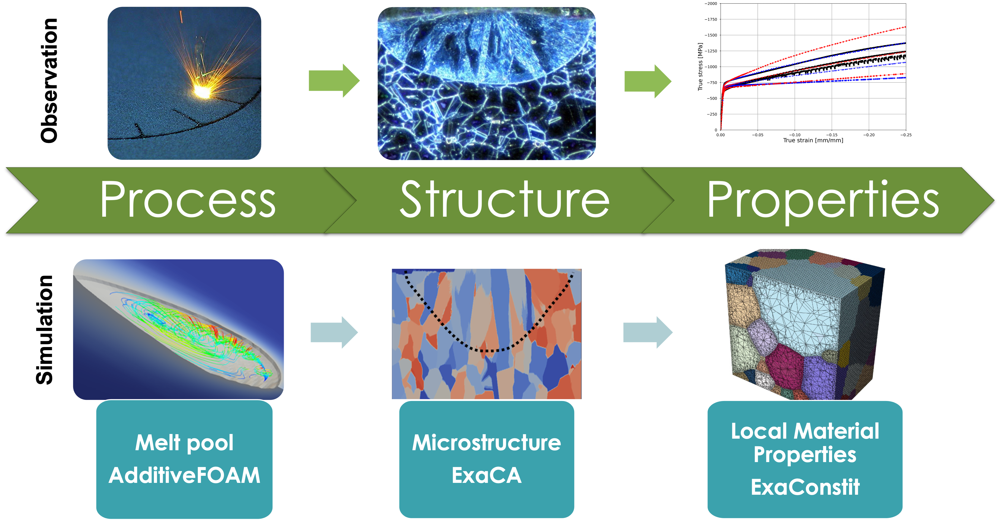

# ExaAM
## Exascale simulation for additive manufacturing

### Primary developement pages

- https://github.com/ORNL/AdditiveFOAM
- https://github.com/LLNL/ExaCA
- https://github.com/LLNL/ExaConstit
- https://github.com/chrisknewman/tusas

### Acknowledgements

Work supported by the Exascale Computing Project (17-SC-20-SC), a collaborative effort of the U.S. DOE Office of Science and the NNSA.